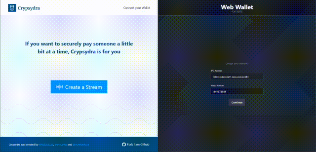

# Wallet Connect SDK
A Coz's Wallet Connect 2.0 SDK for ecosystem tools. WcSdk is an auxiliary library built on
top of [walletconnect](https://github.com/WalletConnect/walletconnect-monorepo).

**Wallet Connect integration is a secure solution for signing transactions sent to a blockchain, such as are needed when
creating Decentralized Applications that require the user's account authentication. This SDK comes in handy to help on
such integration.**

- [Why do I need Wallet Connect in my dApp?](#why-do-i-need-wallet-connect-in-my-dapp)
- [Usage example video](#usage-example-video)
- [How does it work?](#how-does-it-work)
- [Installation and Setup Guide](#installation-and-setup-guide)
- [Using with React.js](packages/wallet-connect-sdk-react/README.md)
- [Using without React.js](packages/wallet-connect-sdk-core/README.md)
- [How to test my dApp?](#how-to-test-my-dapp)

## Why do I need Wallet Connect in my dApp?
Almost every dApp needs user's authentication to send a signed transaction to the blockchain. From minting tokens to
making a simple transfer, users must always sign their transactions whenever the client-side application needs to call a
SmartContract method that requires the user's Account.

Signing a transaction means that, without a solution like Wallet Connect's integration, the user would need to trust his
privateKey to the dApp. For obvious reasons, outside of testing environments, this is a huge security issue, as the dApp
could simply use it maliciously stealing funds or signing something not approved by the user.

[Wallet Connect](https://walletconnect.org/) is an established solution to tackle this issue, and it's already used by
many dApps and users.

## Usage example video

This example is showing [Crypsydra dApp](https://github.com/east-side-cryps/crypsydra-web) connecting with
[Coz's Test Wallet](https://github.com/CityOfZion/web-wallet) 

## How does it work?
- The dApp shows a QRCode, so the user can use its Wallet to establish a connection
    - It's a WebSocket encrypted connection between dApp and Wallet passing by a relay server
- Now, everytime the dApp needs to call a SmartContract, instead of doing it by itself it will ask the Wallet to do so
    - It will send a JSON-RPC message with all the information it needs to send to the SmartContract
    - The Wallet will ask for the user to approve this message
    - It will sign the transaction, make the call and respond back to the dApp with the response from the blockchain
  
## Installation and Setup Guide
This repository contains multiple packages and from here on you need to choose your path. If you are planning to use it
on a React.js application it's highly recommended using our [WC React SDK](packages/wallet-connect-sdk-react/README.md)
that handles all state changes for you, but if you plan to use with a different technology we have all the same features
on the [WC Core SDK](packages/wallet-connect-sdk-core/README.md).

## How to test my dApp?
This SDK uses 
[Wallet Connect 2.0](https://docs.walletconnect.org/v/2.0/) protocol, you will need a Wallet application that works with
it, if you plan to connect with the 
[Neo blockchain](https://neo.org/) we recommend
[Coz's Web Wallet for testing](https://connect.coz.io/). If you plan to connect with
[Ethereum blockchain](https://ethereum.org/) there are
[many wallets](https://registry.walletconnect.org/wallets) to work with.